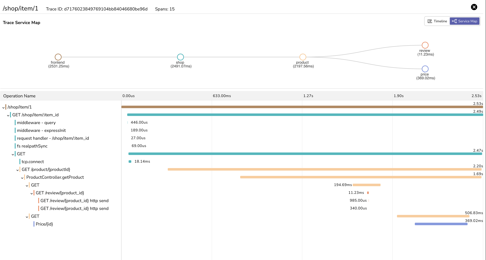

# HOT commerce

HOT Commerce is a collection of microservices demonstrating auto-instrumentation of microservices using OpenTelemetry operator in a kubernetes environment.


```
                                                 /-> review (python)
                                                /
frontend (go) -> shop (nodejs) -> product (java)
                                                \
                                                 \-> price (dotnet)

```

This application has been intentionally kept very simple. It has 5 microservices.

## Prerequisites

1. An existing kubernetes cluster.
1. OpenObserve-collector installed in the cluster.

## Deploy the application

```
kubectl create ns hotcommerce
kubectl apply -f deployment.yaml
```

port-forward the frontend service

```
kubectl -n hotcommerce port-forward svc/frontend 8001:80
```

now access the frontend service at http://localhost:8001/item/1 in your browser. This will kick in the requests and send the traces to OpenObserve.

## Visualize traces

Open traces UI in OpenObserve. You should see traces for the requests made to the frontend service along with other dependent services.



## Automatic instrumentation

Following languages are supported for automatic instrumentation:

1. NodeJS
1. Python
1. Java
1. Dotnet
1. Go (Uses eBPF)

Refer to the `deployment.yaml` file to see how the services are configured to use automatic instrumentation.
